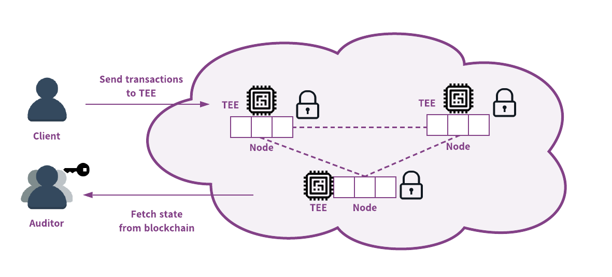

[English](/blog/2020-12-09-teaclave-ecosystem/) | [中文](/blog/2020-12-04-teaclave-ecosystem-cn/)

Apache Teaclave (incubating) ([https://teaclave.apache.org/](https://teaclave.apache.org/))是全球首个通用安全计算平台，为隐私数据计算赋能，让安全计算更简单。Teaclave 基于硬件安全能力（Intel SGX），确保敏感数据在可信域外和离岸场景下安全可控的流通和处理，无需担心隐私数据泄露和滥用。同时，Teaclave 还支持多方参与的联合计算，打破企业和组织中的数据孤岛。Teaclave 于 2019 年 8 月进入 Apache 基金会孵化器，2020 年 10 月，Teaclave 社区正式通过并发布了 0.1.0 版。

## Teaclave 的四大亮点

简单来说，Teaclave 有四大亮点：

- **安全性**：Teaclave 使用多重安全技术保护隐私数据的计算。我们使用 Intel SGX，提供基于硬件隔离、内存加密、远程证实等安全技术保护数据隐私计算任务。不仅如此，为了避免内存安全漏洞带来的安全风险，Teaclave 还使用内存安全编程语言 Rust 编写。
- **功能性**：Teaclave 平台提供了更加便利的函数即服务（function-as-a-service）接口，大大的降低了使用门槛。平台中也实现了众多内置函数，例如机器学习算法，多方联合求交，加解密计算等等常用功能。更重要的是，开发者还可以使用 Python 自由编写函数来操作隐私数据，提交至 Teaclave 平台执行。与传统 FaaS 框架不同的是，Teaclave 提供了灵活的多方参与计算接口，大大简化多方安全计算的流程。
- **易用性**：Teaclave 提供便利的部署方式，支持在本地和云上以容器的方式进行部署。项目中还提供了完善的接口，客户端 SDK 以及命令行工具帮助开发者使用平台的功能。
- **灵活性**：Teaclave 设计了灵活的组件和服务框架，其他项目仅需少量修改就可以使用 Teaclave 中的各种组件。例如，可以在项目中使用 Teaclave 远程证实库作为第三方依赖库，或者直接单独部署使用 Teaclave 中的数据库服务等。当然，开发者也可使用 Teaclave SGX SDK （原 Rust SGX SDK）来构建全新的 SGX 应用。

## **Teaclave 开源生态**

Teaclave 提供了一个开放的开源生态，其中既有 Teaclave 项目的开发者，也包括安全计算平台的用户、服务提供商，以及在安全计算相关项目中使用了 Teaclave 中的核心库和第三方常用库的使用者。另一方面，Teaclave 生态服务于商业产品、学术研究项目、可信计算教学平台，同时社区也支持由 Teaclave 驱动的第三方开源项目。

在可信执行环境中，第三方库的移植、维护、审计尤为重要。我们为 Teaclave 生态提供了上百个 Rust 的第三方开发库，比如密码学库，科学计算库，机器学习库等等，大大的丰富了 Teaclave 生态，并且驱动了其他基于 Teaclave 的开源项目发展。除了维护第三方库，我们也孵化出了一些重要的 TEE 组件，比如，针对 SGX 环境的 Python 解释器 - MesaPy ([https://github.com/mesalock-linux/mesapy/tree/sgx](https://github.com/mesalock-linux/mesapy/tree/sgx))，以及对 TrustZone 后端 TEE 实现的 SDK - Rust OP-TEE TrustZone SDK ([https://github.com/sccommunity/rust-optee-trustzone-sdk](https://github.com/sccommunity/rust-optee-trustzone-sdk))。

Teaclave 开源生态也支持着众多商业产品。比如，基于 Teaclave 开源代码，百度作为平台服务提供商，构建了 MesaTEE 安全计算平台，该平台提供了强安全、高性能、易扩展的芯片级数据安全计算解决方案。协助机构之间解决数据合作过程中数据安全和隐私问题，打破数据孤岛。 通过私有化或云服务帮助金融、政务、互联网等行业在联合建模、联合营销、联合风控等场景下一站式完成数据联合计算，实现 “数据可用不可见”的安全体验。

Teaclave 生态也支持着可信计算和系统安全相关的学术研究，其中包括可信执行环境的安全，内存安全的 SGX SDK 设计，SGX 第三方库生态的安全等等相关课题。其中有多篇学术成果发表在国际顶级会议上。

## **由 Teaclave 驱动的开源项目**

正因为 Teaclave 的开源、开放及其灵活性，许多项目基于 Teaclave 平台或 SGX SDK 构建，以下列举了几个由 Teaclave 驱动的开源项目或商业产品。希望更多的公司、项目能够加入安全计算的生态当中，共同推动数据隐私、安全计算的发展。

- **Advanca** 是服务于去中心化应用（Dapps）的一个通用的隐私保护计算/存储基础设施。[https://github.com/advanca/advanca](https://github.com/advanca/advanca)
- **Anonify**: 在区块链上利用可信执行环境 (TEE) 技术，向用户提供防篡改的数据共享技术设施；在灵活执行业务逻辑同时，保证分布式账本中各个参与者的数据隐私。[https://github.com/LayerXcom/anonify](https://github.com/LayerXcom/anonify)

- **Enigma** 联合多个区块链厂商构建去中心化网络联盟 — Secret Network，为区块链用户提供数据隐私保护服务。在 Secret Network 中，用户数据密文作为输入被智能合约执行，执行结果基于共识协议验证后上链。[https://github.com/enigmampc/enigma-core](https://github.com/enigmampc/enigma-core), [https://github.com/enigmampc/SecretNetwork](https://github.com/enigmampc/SecretNetwork)

- **Crypto.com** 的试验性项目 Crypto.com chain 中使用 Teaclave 进行 SGX 应用的开发。[https://github.com/crypto-com/chain](https://github.com/crypto-com/chain)
- **Phala Network** 是一个 TEE-区块链混合结构实施的智能合约。[https://github.com/Phala-Network/phala-blockchain](https://github.com/Phala-Network/phala-blockchain)
- **SafeTrace** 项目是一个隐私保护的新型冠状病毒追踪系统，使用 SGX 保证用户的位置数据能够安全的进行交换。[https://github.com/enigmampc/SafeTrace](https://github.com/enigmampc/SafeTrace)
- **substraTEE** 为 substrate blockchains 提供了可信的 off-chain 计算框架。[https://github.com/scs/substraTEE](https://github.com/scs/substraTEE)
- **Occlum** 项目是基于 Teaclave SGX SDK 提供了一个 library OS 类型的 SGX 可信执行环境，使应用程序几乎不需要修改源代码即可放入 SGX 上运行。该项目即将加入 Confidiential Computing Consortium 机密计算联盟。[https://github.com/occlum/occlum](https://github.com/occlum/occlum)
- **Veracruz** 是一个多方不信任环境下的隐私保护的计算框架。该项目即将加入 Confidiential Computing Consortium 机密计算联盟。[https://github.com/veracruz-project/veracruz](https://github.com/veracruz-project/veracruz)

以上些项目都是利用 TEE 提供的硬件隔离、内存加密、远程证实等特性，保护业务中数据计算的隐私。一些项目在 SGX SDK 基础上提供了更为便利的可信执行环境框架，比如 Occlum 和 Veracruz。另外一些项目使用 SGX SDK 编写 TEE 应用保护其业务逻辑中的数据隐私，或提供可信的节点，如 Secret Network 和 substraTEE。还有一些项目移植使用 Teaclave 平台里的通用模块，比如远程证实代码库等等。更多关于由 Teaclave 驱动的开源项目列表可以在官网中查看（[https://teaclave.apache.org/community/](https://teaclave.apache.org/community/)）。

最后，Teaclave 项目非常欢迎大家共同参与社区，推动隐私安全计算发展。
