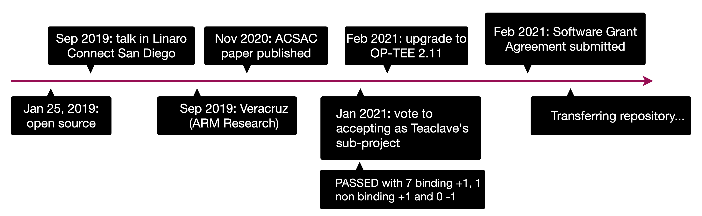

Last time, we discussed setting the meetup as a regular activity (i.e., the
last Thursday in each Month). On Feb 25, we organized the second Teaclave
virtual meetup. Around ten people from the community showed up in the virtual
meetup. Thanks for attending the meetup. Hope to see more people in the next
meetup and sharing your ideas.

For people who were not available at this time, here is a short summary.

## Schedule

- Recent updates on Teaclave, Mingshen Sun (15 m)
- Q&A and free discussion (45 m)

## Recent Updates on Teaclave

Mingshen shared some recent updates on Teaclave with following outlines:

- Teaclave TrustZone SDK donation
- Releasing Apache Teaclave (incubating) 0.2.0
- Teaclave Client SDK in Swift (iOS framework)
- Talks in OC3 - Open Confidential Computing Conference 2021, Mar 11

### Rust OP-TEE TrustZone SDK donation

For the recent donation on Rust OP-TEE TrustZone SDK, here is a timeline of the
project. Currently, this project is under transfer and will be under the
Apache organization on GitHub in the next few days.

### Teaclave Client SDKs

Mingshen also gave a brief introduction on the design and implementation of
Teaclave client SDKs in different languages and their relationships.

## Demo of Rust Std Aware Cargo

One of our contributor `lyj` also demonstrated his efforts on std aware Cargo
(#311 in `incubator-teaclave-sgx-sdk`). By using this method, people no longer
needs `Xargo` or `no-std` to build the SGX enclave. Hope this improvement will
ease the development of SGX enclaves and porting crates.

At last, thanks for attending this meetup. I'll continue to drive this meetup
and make it a monthly activity for the community. If you want to speak in the
next time, please post your proposed topic in the mailing list. I'll help you to
schedule the time.
