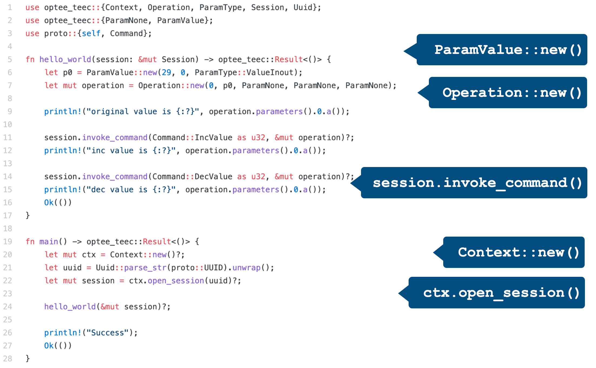
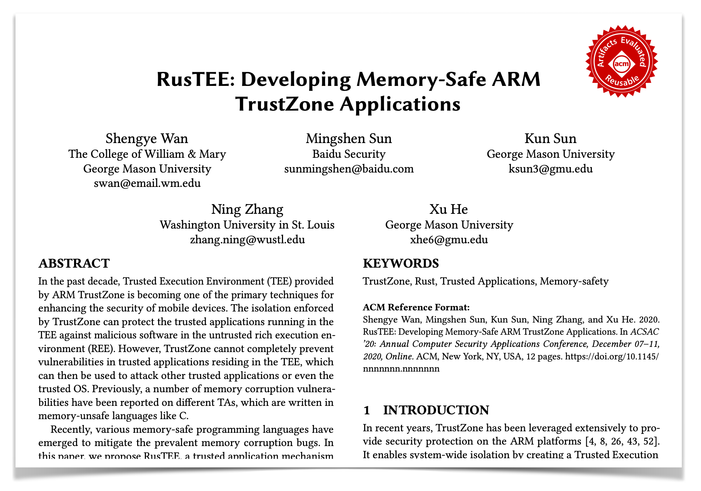
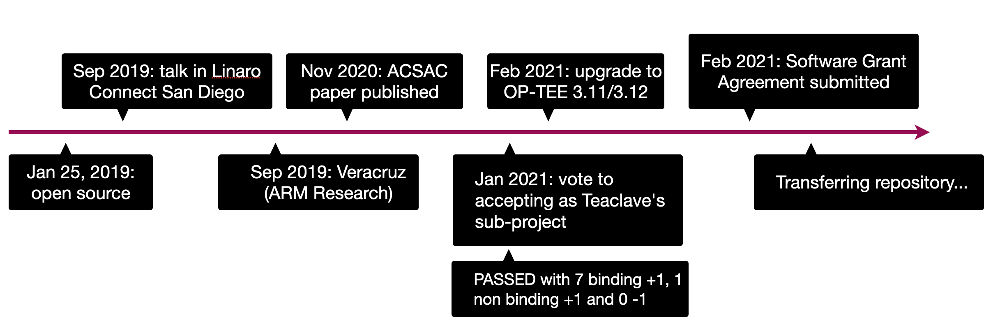

[English](/blog/2021-03-14-welcome-rust-optee-trustzone-sdk) | [中文](/blog/2021-03-14-welcome-rust-optee-trustzone-sdk-cn)

TrustZone 为手机、嵌入式设备、云计算等 ARM 生态提供安全的可信执行环境，用于包括
安全支付、密钥管理、模型保护等场景。但是由于内存安全问题，TrustZone 中运行的安全
应用 (trusted application 或叫 TA) 的安全性大打折扣。
例如[高通 QSEE 内存安全问题](http://bits-please.blogspot.com/2016/05/qsee-privilege-escalation-vulnerability.html)
[1] 造成的安全世界（secure world) 的漏洞，
后果甚至可以[拿到全磁盘加密的密钥](http://bits-please.blogspot.com/2016/06/extracting-qualcomms-keymaster-keys.html) [2]。

2019 年初百度开源了 Rust OP-TEE TrustZone SDK，为当今广泛使用的开源 TrustZone 实
现 OP-TEE 提供了一套**内存安全**、**使用方便**的 SDK。SDK 基于 GlobalPlatform 的
TEE 标准，为开发者提供标准的开发接口。除此之外 Rust OP-TEE TrustZone SDK **支持
标准库**和**第三方库**，提高了 TA 的开发速度，并扩展了 TrustZone 的应用场景。

为了加速隐私安全生态发展，完善 TrustZone 的技术基础设施，百度在 2021 年初正式把
项目捐赠给 Apache 基金会，作为 Teaclave 的子项目之一，同时更名为 Teaclave
TrustZone SDK，新的项目代码库地址为：
[https://github.com/apache/incubator-teaclave-trustzone-sdk](https://github.com/apache/incubator-teaclave-trustzone-sdk)
。Teaclave TrustZone SDK 与 Teaclave SGX SDK 一样，可以为 Teaclave FaaS 隐私安全
计算平台提供底层支持，赋能多平台可信执行环境的隐私安全计算生态。

## Teaclave TrustZone SDK 设计和实现

Teaclave TrustZone SDK 在 GlobalPlatform 标准的 API 上重新设计了安全的 Rust 接口，
使用 Rust 编写 TA（图中的 trusted apps）和 app（图中 client apps）能够大大减少内
存安全问题，确保可信执行环境的安全。

通过使用 Rust 的过程宏（procedure macro）自动生成边界代码，减少了开发中不必要的
负担，并且能够避免开发中因为粗心造成的安全问题。如下图所示，只需要在相应的函数上
加 `#[ta_create]`, `#[ta_open_session]`, `#[ta_close_session]`, `#[ta_destory]`,
`#[ta_invoke_command]`。

通过利用 Rust 的丰富的类型系统，能在编译时报告内存安全问题，例如下图中对于
client 的实现，相比复杂并且类型简单的 C 接口，Rust API 语义更清晰，并提供强类型
检查。

项目中提供了 13 个样例程序，包括加解密，安全存储，HOTP 等等。同时，我们还展示了
使用 Rust 的第三方库 serde 作为边界的序列化来传递复杂参数，避免出现安全边界设计
不当引发的内存安全问题。

## 快速上手、文档

Teaclave TrustZone SDK 的 API 都提供了对应的文档，在项目 Wiki 中，我们提供了一个
快速上手的例子，在 QEMU 模拟器中运行使用 TrustZone SDK 的 trusted app。链接如下：
[https://github.com/apache/incubator-teaclave-trustzone-sdk/wiki/Getting-started-with-OPTEE-for-QEMU-ARMv8](https://github.com/apache/incubator-teaclave-trustzone-sdk/wiki/Getting-started-with-OPTEE-for-QEMU-ARMv8)
。更多关于 Teaclave TrustZone SDK 的设计和性能等都在论文 RusTEE: Developing
Memory-Safe ARM TrustZone Applications 中找到，此论文也收录于 ACSAC 2020。

## Teaclave TrustZone SDK 时间线

- 2019 年初开源。
- 2019 年在 Linaro Connect 和 RustCon Asia 对外发布，得到了 ARM 的支持，现在其隐私计算相关项目中使用。
- 2020 年相关文章发表在国际顶级安全会议 ACSAC，得到学术界肯定。
- 随着隐私安全计算的发展，多个开源项目开始使用，例如由 ARM Research 主导的 Veracruz 开源项目使用 SDK 构建其隐私计算试验项目，Veracurz 也将加入隐私计算联盟（Confidential Computing Consortium）。
- 2021 年 2 月升级 TrustZone SDK 支持 OP-TEE 3.11 和 3.12。
- 2021 年 2 月启动项目捐赠流程，通过社区投票并提交 Software Grant Agreement。
- 2021 年 3 月项目 repository 正式移交到 Apache 组织下，隶属于 Apache Teaclave (incubating) 项目。

## Teaclave 开源社区

TrustZone SDK 加入 Apache 后，将与 Teaclave 开源社区共同发展，非常欢迎大家的贡献，
一起推动隐私安全计算生态 。已有至少四家公司或组织在产品中使用 Teaclave，并且有超
过九个开源项目使用了 Teaclave 平台和 Teaclave SGX SDK。这些都给项目的发展提供源
源不断的动力。更多信息可以在我们的官网 community 下查看：
[https://teaclave.apache.org/community/](https://teaclave.apache.org/community/)

Teaclave 的开源是 [The Apache Way](https://www.apache.org/theapacheway/)
([https://www.apache.org/theapacheway/](https://www.apache.org/theapacheway/))
的开源，无论是代码、文档、设计还是路线图规划，我们都会在社区的各个渠道中讨论。如
果 你想关注 Teaclave，亦或想加入我们的讨论，可以在 [Github issues](https://lists.apache.org/list.html?dev@teaclave.apache.org)，邮件列 表
回复我们、发起新的话题。也可以关注我们的 Twitter 账号
[@ApacheTeaclave](https://twitter.com/ApacheTeaclave)了解最新动态。除此之外，
我们在[官网](https://teaclave.apache.org/docs/papers-talks/)
([https://teaclave.apache.org/](https://teaclave.apache.org/))中提供了
Teaclave 相关的演讲、论文和文章，包括 TrustZone SDK 之前的演讲 slides 以及视频。

参考链接：

[1] Qualcomm's Secure Execution Environment (QSEE) privilege escalation
vulnerability and exploit (CVE-2015-6639) :
[http://bits-please.blogspot.com/2016/05/qsee-privilege-escalation-vulnerability.html](http://bits-please.blogspot.com/2016/05/qsee-privilege-escalation-vulnerability.html)

[2] Extracting Qualcomm's KeyMaster Keys - Breaking Android Full Disk
Encryption:
[http://bits-please.blogspot.com/2016/06/extracting-qualcomms-keymaster-keys.html](http://bits-please.blogspot.com/2016/06/extracting-qualcomms-keymaster-keys.html)
