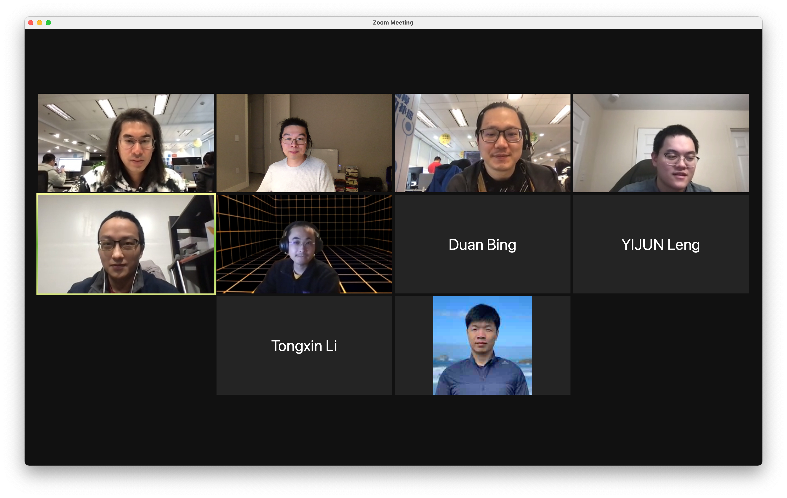

In March 25, we gathered in Zoom for the third monthly Teaclave meetup. In this
meetup, we're glad to have two speakers talking about some initial progress of
Teaclave verification and comparison of public cloud attestation services.

## Schedule

- Recent Update of Teaclave, Mingshen (3m)
- Teaclave Verification, Sean (15m)
- Comparison of Public Cloud Attestation Services, Mengyuan Li (45 m)

## Teaclave Verification

In this session, Sean talked introduced the plan of Teaclave verification.
The main ideas is to create formal descriptions, specifications, and proofs for
some core components of Teaclave.

The initial effort on this field is trying to formally describe the access
control module in Teaclave. And then prove it with requirements defined in
[Common Criteria for Information Technology Security Evaluation](https://www.commoncriteriaportal.org/files/ccfiles/CCPART2V3.1R5.pdf).
The security objective of access control module is to prevent unauthorized users
from accessing the critical data through tasks and functions. By achieving the
security objective, the threats of runtime tasks and functions abuse are
eliminated under the assumptions identified in security problem definition.
With these objectives, we can find some corresponding requirements in Common
Criteria, e.g., FIA_UAU.2 for user authentication before any action.

The initial work has been accepted as a separate project in Teaclave.
If you are interested in this topic, please see
<https://github.com/apache/incubator-teaclave-verification> to learn more.

## Comparison of Public Cloud Attestation Services

Then, Mengyuan talked his recent research on attestation, especially, on public
cloud attestation services.

Here the abstract of the talk:

Confidential computing is an emerging security feature provided by more and more
public cloud service providers (e.g., Amazon AWS, Microsoft Azure, and Google
Cloud) in order to help customers protect their sensitive data in the cloud
environment. Some popular confidential computing services include Intel Software
Guard Extensions (SGX) enclaves and AMD Secure Encrypted Virtualization (SEV)
VMs. These services are usually atop different hardware-based Trusted Execution
Environments (TEE) technologies.

Meanwhile, to help convince the customers the trustworthiness of the platform
hardware and the integrity of codes inside the TEE, cloud services providers
also offer remote attestation services. In this talk, we will first cover the
remote attestation workflow provided by some famous cloud TEE services,
including Azure Open Enclave, Nitro Enclave, Google confidential computing VM
and Fortanix. From the perspective of customers, we also focus on the
attestation reports the customers can get. We then introduce Teaclave's current
attestation design and discuss the attestation report standard Teaclave should
follow.

He also discussed the attestation design of Teaclave.

In the end, he also summarized the roles in the attestation ecosystem and
positions of services/products discussed in this talk.

At last, thanks for attending this meetup. I'll continue to drive this meetup
and make it a monthly activity for the community. If you want to speak in the
next time, please post your proposed topic in the mailing list. I'll help you to
schedule the time.
