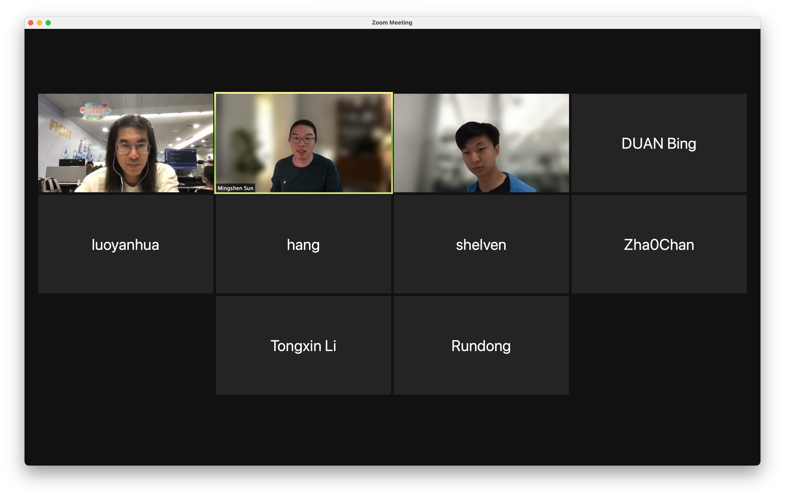

In Jun 24, we gathered in Zoom for the fifth monthly Teaclave meetup. In this
meetup, we're glad to have Hongbo (@ya0guang) talking about his contributions on
adding WebAssembly Micro Runtime to Teaclave as an executor (PR:
[#504](https://github.com/apache/incubator-teaclave/pull/504),
[#512](https://github.com/apache/incubator-teaclave/pull/512)).

## Schedule

- Recent update of Teaclave, Mingshen (5m)
- Executing WebAssembly in Teaclve, Hongbo (40m)
- Open discussion

## Notes

### Recent Update of Teaclave

**Teaclave TrustZone SDK version 0.1.0 released**
- Vote result: [https://lists.apache.org/thread.html/r441addf283f6c8780326f372e39a9d723164f6d910184ea3686a5c4a%40%3Cdev.teaclave.apache.org%3E](https://lists.apache.org/thread.html/r441addf283f6c8780326f372e39a9d723164f6d910184ea3686a5c4a%40%3Cdev.teaclave.apache.org%3E)
- Release notes: <https://github.com/apache/incubator-teaclave-trustzone-sdk/releases/tag/v0.1.0>
- Download link: <https://teaclave.apache.org/download/>

**Linaro OP-TEE Contributions meeting**
- Recording: [https://linaro-org.zoom.us/rec/share/0o3Ku4zaXSrP-Ep0WI5P-XB-KAiP5d94kXbKmg43VqrnRHUmsLV_sv1wI01JbL0C.kSM-_ov2pc9Sggf_](https://linaro-org.zoom.us/rec/share/0o3Ku4zaXSrP-Ep0WI5P-XB-KAiP5d94kXbKmg43VqrnRHUmsLV_sv1wI01JbL0C.kSM-_ov2pc9Sggf_), Passcode: 9c.&%KR6
- Slides: [https://drive.google.com/file/d/1YPig8k-xRyeRxuu1ALTmkqY-nxtH5upR/view?usp=sharing](https://drive.google.com/file/d/1YPig8k-xRyeRxuu1ALTmkqY-nxtH5upR/view?usp=sharing)

### Executing WebAssembly in Teaclave

- [Slides](./pdf/teaclave-meetup-5-executing-webassembly-in-teaclave.pdf)

Some question and discussion:

- Can we reuse the WebAssembly runtime to improve the performance of startup?
- Bridging `tlibc` functions into WAMR.

### Open Discussion

- ARM CCA: <https://www.arm.com/why-arm/architecture/security-features/arm-confidential-compute-architecture>
- EdgelessSys mablerun: <https://github.com/edgelesssys/marblerun>
- Attestation mechanism in Google Cloud Confidential Computing
