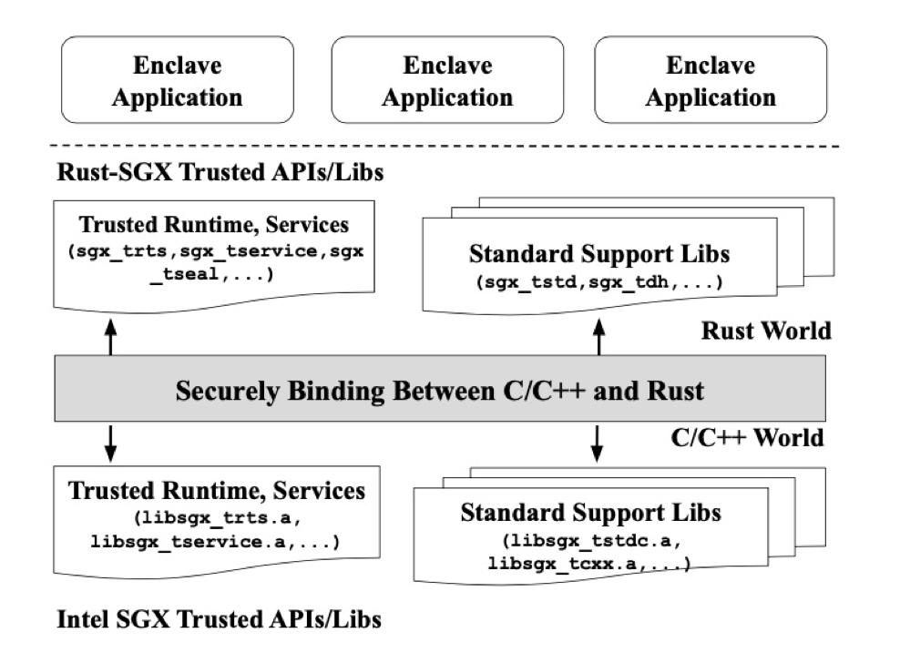

<!-- TOC -->

- [1 Teaclave SGX SDK应用开发环境简介以及搭建](#1-teaclave-sgx-sdk应用开发环境简介以及搭建)
    - [1.1 准备条件](#11-准备条件)
    - [1.2 硬件模式+docker真实执行](#12-硬件模式docker真实执行)
- [2 一个简单的 Rust SGX 程序：helloworld](#2-一个简单的-rust-sgx-程序helloworld)
    - [2.1 helloworld 目录结构](#21-helloworld-目录结构)
    - [2.2 重要代码文件解析](#22-重要代码文件解析)
    - [2.3 编译后的代码目录](#23-编译后的代码目录)
- [3 开发者如何开发自己的 Rust SGX Application](#3-开发者如何开发自己的-rust-sgx-application)
    - [3.1 添加自定义的函数](#31-添加自定义的函数)
    - [3.2 调用 Teaclave SGX SDK 提供的 `crate`](#32-调用-teaclave-sgx-sdk-提供的-crate)
- [4 总结](#4-总结)
- [5 一些小tip](#5-一些小tip)
- [6 参考](#6-参考)

<!-- /TOC -->


# 1 Teaclave SGX SDK应用开发环境简介以及搭建

Intel SGX (软件防护扩展，Software Guard Extension) 提供了在一个安全的enclave中执行代码的能力，enclave可以提供一个隔离的可信执行环境，在操作系统、BIOS和虚拟机监控器等系统软件均不可信的情况下，仍然对enclave内部的代码和数据提供保护，保障用户的关键数据和代码的机密性和完整性。

但 SGX 程序仍然是使用 C/C++ 这类内存不安全的语言开发的，和传统软件一样，面临着传统的内存破坏漏洞，enclave 也并不能保证内部运行的软件的内存安全。Teaclave SGX 的主要目标就是通过使用高效的内存安全语言—— Rust 来支持 enclave 应用程序的开发，从而在保证 SGX enclave 内存安全的同时不会带来显著的性能开销。

Teaclave SGX 内部结构分为三层：

+ 最底层是通过 C/C++ 和汇编实现的 Intel SGX SDK；
+ 中间层是 Rust 对 C/C++ 的 FFI (Foreign function Interfaces, 外部函数接口)；
+ 最高层是 Teaclave SGX SDK。



Teaclave SGX Application 开发者在进行开发时就只需要基于最上层的 Teaclave SGX SDK 来进行开发，底层的实现对于开发者来说是透明的。本文将从开发者的角度介绍基于 Teaclave SGX SDK 开发自己的应用程序的过程。

## 1.1 准备条件

+ Ubuntu16.04 or 18.04 or 20.04 (v1.1.3增加了该支持)
+ docker环境

注：*本文基于 Teaclave SGX SDK v1.1.3(最新更新时间为2021年8月12日)* 


## 1.2 硬件模式+docker真实执行

首先需要用户机器 CPU 支持 SGX +主板开启了 SGX 支持。用户可以通过 [SGX-hardware项目](https://github.com/ayeks/SGX-hardware) 或者在 [Intel 官网](https://www.intel.com/content/www/us/en/products/details/processors.html)中搜索自己的机器类型查看是否支持 SGX。下图以 intel Core i7-7700K 处理器为例，如下图所示，该机型支持 SGX。


当确定主板支持 SGX 之后，还需要开启 BIOS 中的 SGX 选项，开启过程可以通过执行 [sgx-software-enable](https://github.com/intel/sgx-software-enable) 来完成。 在硬件条件准备完毕之后，需要安装[linux SGX驱动](https://download.01.org/intel-sgx/sgx-linux/2.10/distro/ubuntu16.04-server/sgx_linux_x64_driver_2.6.0_602374c.bin)，安装完毕之后需要确认 `/dev/isgx` 的存在。

下载 Teaclave SGX SDK 以及支持 SGX 设备的docker。

`$ https://github.com/apache/incubator-teaclave-sgx-sdk`

`$ docker pull baiduxlab/sgx-rust`

启动一个 docker。

`$ docker run -v /your/absolute/path/to/incubator-teaclave-sgx-sdk:/root/sgx -ti --device /dev/isgx baiduxlab/sgx-rust`

在docker中启动aesm服务。

````bash
root@docker:/# LD_LIBRARY_PATH=/opt/intel/sgx-aesm-service/aesm/ /opt/intel/sgx-aesm-service/aesm/aesm_service &
aesm_service[17]: [ADMIN]White List update requested
aesm_service[17]: Failed to load QE3: 0x4004
aesm_service[17]: The server sock is 0x56096ab991c0
aesm_service[17]: [ADMIN]White list update request successful for Version: 103
````

执行samplecode中的简单实例，检查系统是否正常运行。

```bash
root@docker:~# cd sgx/samplecode/helloworld/
root@docker:~/sgx/samplecode/helloworld# make
root@docker:~/sgx/samplecode/helloworld# cd bin/
root@docker:~/sgx/samplecode/helloworld/bin# ./app
[+] global_eid: 2
This is normal world string passed into enclave!
This is a Rust string!
[+] say_something success ...
```
至此，我们已经成功在自己的机器上跑起来了示例的 Teaclave SGX SampleCode啦！

# 2 一个简单的 Rust SGX 程序：helloworld

接下来，我们通过阅读 helloworld 这个简单的例子来理解 Rust SGX application 的组织结构和运行方式。

## 2.1 helloworld 目录结构

helloworld/ \
├── app \
│   ├── app.c \
│   └── app.h \
├── bin \
│   └── readme.txt \
├── enclave \
│   ├── Cargo.toml \
│   ├── Enclave.config.xml \
│   ├── Enclave.edl \
│   ├── Enclave.lds \
│   ├── Enclave_private.pem \
│   ├── Makefile \
│   ├── src \
│   │   └── lib.rs \
│   ├── x86_64-unknown-linux-sgx.json \
│   └── Xargo.toml \
├── lib \
│   └── readme.txt \
└── Makefile 

helloworld 的目录结构和 [SGX SampleEnclave](https://github.com/intel/linux-sgx/blob/HEAD/SampleCode/SampleEnclave) 目录结构非常类似。
+ app 目录中存放的是不可信区域代码，包括 `main` 函数以及 `OCALL` 函数具体逻辑实现。
+ enclave 目录中存放的是可信区域代码，主要是 `ECALL` 函数具体逻辑实现。
    + 不同于 SGX ，应用安全区的代码实现并不位于 `Enclave.h`和 `Enclave.cpp` ，而是在 **`src/lib.rs`**, 该文件是整个 `helloworld` 文件夹中唯一使用 Rust 编写的文件，程序员可以在该文件中增加需要添加的功能。
    + 另外，enclave 文件夹下多了 `Cargo.toml`, `src/lib.rs`, `x86_64-unknown-linux-sgx.json`, `Xargo.toml`
        + **`Cargo.toml`**: 项目清单文件，包括项目名称、项目版本以及依赖项等；
        + **`x86_64-unknown-linux-sgx.json`**: 存储了描述项目基本信息的数据;
        + **`Xargo.toml`**: 定义依赖项的细节信息以及编译所需要的头文件信息。

## 2.2 重要代码文件解析

+ **`Enclave.edl`** \
该文件规定了 Enclave 边界 ECALL/OCALL 的定义。

```edl
enclave {
    from "sgx_tstd.edl" import *;
    from "sgx_stdio.edl" import *;
    from "sgx_backtrace.edl" import *;
    from "sgx_tstdc.edl" import *;

    trusted {
        /* define ECALLs here. */

        public sgx_status_t say_something([in, size=len] const uint8_t* some_string, size_t len);
    };

    untrusted {

    };
};
```

`trusted {...}` 中声明 `ECALL` 函数， `untrusted {...}` 中声明 `OCALL` 函数。本例中声明了一个 `ECALL` 函数 `say_something`，该函数的具体实现在 `lib/src.rs` 中，它的参数包括 `uint8_t *` 类型的指针和长度参数 `len`。SGX 根据 `len` 参数确定需要将多少的字节的参数拷贝到 Enclave 中，指针参数指向Enclave内存。

+ **`app/app.c`** \
在 `app/app.c` 的 `main` 函数中有一个完整的调用 ECALL 的例子。

```c
sgx_ret = say_something(global_eid,
                        &enclave_ret,
                        (const uint8_t *) str,
                        len);
```

这里的 `say_something` 似乎和 `Enclave.edl` 中的声明不太一致，ECALL传递参数时多了两个隐参数：`enclave_eid` 和 `say_something` 的返回值 `&enclave_ret`。而 `sgx_ret` 表示的是 ECALL 执行是否成功，是 SGX 的返回值。

+ **`enclave/`文件夹部分** \
`enclave/Cargo.toml` 中声明了这是一个 `staticlib`，表明 Enclave 在最后会被编译成一个 `.a` 文件，该文件会和Intel提供的 `sgx_tstdc.a` 等文件链接形成 `enclave.so`，再经由 `sgx_sign` 工具配合 `Enclave.config.xml` 配置文件、`Enclave_private.pem` 签名私钥做签名和属性刻画，最后生成 `enclave.signed.so`，这是 Enclave 的完全体。

+ **`enclave/src/lib.rs`** \

```rust
pub extern "C" fn say_something(some_string: *const u8, some_len: usize) -> sgx_status_t {

    let str_slice = unsafe { slice::from_raw_parts(some_string, some_len) };
    let _ = io::stdout().write(str_slice);

    // A sample &'static string
    let rust_raw_string = "This is a ";
    // An array
    let word:[u8;4] = [82, 117, 115, 116];
    // An vector
    let word_vec:Vec<u8> = vec![32, 115, 116, 114, 105, 110, 103, 33];

    // Construct a string from &'static string
    let mut hello_string = String::from(rust_raw_string);

    // Iterate on word array
    for c in word.iter() {
        hello_string.push(*c as char);
    }

    // Rust style convertion
    hello_string += String::from_utf8(word_vec).expect("Invalid UTF-8")
                                               .as_str();

    // Ocall to normal world for output
    println!("{}", &hello_string);

    sgx_status_t::SGX_SUCCESS
}
```
该函数实现了一个简单的将u8数组转化为字符串输出的函数，注意在函数的最后调用的 `println!` 函数是一个 `OCALL`。 `println!` 的具体实现中加入了内置的 `OCALL`，并定义了内置的 EDL，import到了 `Enclave.edl` 中。 
```edl
enclave {
    from "sgx_tstd.edl" import *;
    from "sgx_stdio.edl" import *;
    from "sgx_backtrace.edl" import *;
    from "sgx_tstdc.edl" import *;
```


## 2.3 编译后的代码目录 
经过编译之后的代码目录如下所示，这里省略了 `release` 文件夹下的内容。

├── app \
│   ├── app.c \
│   ├── app.h \
│   ├── app.o               #[generate] \
│   ├── Enclave_u.c         #[generate] \
│   ├── Enclave_u.h         #[generate] \
│   └── Enclave_u.o         #[generate] \
├── bin \
│   ├── app                 #[generate] \
│   ├── enclave.signed.so   #[generate] \
│   └── readme.txt \
├── enclave \
│   ├── Cargo.lock          #[generate] \
│   ├── Cargo.toml \
│   ├── Enclave.config.xml \
│   ├── Enclave.edl \
│   ├── Enclave.lds \
│   ├── Enclave_private.pem \
│   ├── enclave.so          #[generate] \
│   ├── Enclave_t.c         #[generate] \
│   ├── Enclave_t.h         #[generate] \
│   ├── Enclave_t.o         #[generate] \
│   ├── Makefile \
│   ├── src \
│   │   └── lib.rs \
│   ├── target              #[generate] \
│   │   ├── CACHEDIR.TAG    #[generate] \
│   │   └── release         #[generate] \
│   ├── x86_64-unknown-linux-sgx.json \
│   └── Xargo.toml \
├── lib \
│   ├── libenclave.a        #[generate] \
│   ├── libsgx_ustdc.a      #[generate] \
│   └── readme.txt \
└── Makefile 

helloworld 编译的基本流程类似于 SGX:
+ EDL 编译器 `edger8r` 将输入的 EDL 在 `app/` 目录下生成不可信代码 `Enclave_u.h` 和 `Enclave_u.c`；
+ 编译不可信部分生成 `bin/app`；
+ `edger8r` 在 `enclave/` 目录下生成可信代码 `Enclave_t.h` 和 `Enclave_t.c`；
+ 编译并签名生成可信动态链接库 `enclave.signed.so`。  

# 3 开发者如何开发自己的 Rust SGX Application
同样类似于开发 SGX Application，用户可以通过改写 Teaclave SGX SDK 所提供的 `samplecode`，在这里，我以一个简单的例子抛砖引玉。

## 3.1 添加自定义的函数
假设用户希望在 Teaclave SGX 中实现一个简单的求两个数组的交集的函数，只需要直接在 `src/lib.rs` 中添加实现的函数。下面的实例代码 `intersect` 函数是希望添加的求交集函数。传入的两个参数是需要求交集的 `i32` 数组，最后返回的是两个数组的交集。其具体的实现是通过一个额外的哈希表，记录 `num1` 中的每个元素以及出现的次数，再对 `num2` 进行遍历，如果 `num2` 中的元素与哈希表的键相等且对应的值不为0，则将该键 push 到交集数组中，并将对应的值减一。当 `num2` 遍历完毕之后，返回交集数组。

```rust
fn intersect(nums1: Vec<i32>, nums2: Vec<i32>) -> Vec<i32> {
    let mut map: HashMap<i32, i32> = HashMap::new();
    let mut vec: Vec<i32> = Vec::new();

    for i in nums1.iter() {
        let count = map.entry(*i).or_insert(0);
        *count += 1;
    }

    for i in nums2.iter() {
        if map.contains_key(i) {
            if map[i] > 0 {
                vec.push(*i);
            }
            if let Some(value) = map.get_mut(i) {
                *value -= 1;
            }
        }
    }
    return vec;
}
```

需要调用该函数时，在 `say_something` 中添加：
```rust
    println!("\nTry intersection for our own");
    let nums1: Vec<i32> = vec![1, 2, 3, 4, 5];
    let nums2: Vec<i32> = vec![4, 5, 6, 7, 8];
    let vec: Vec<i32> = intersect(nums1, nums2);
    println!("intersection set is {:?}", vec);

```

`say_something` 是 ECALL 的入口，或许你也发现了，这里我将 `say_something` 当成了 Enclave 的 `"main"` 函数来使用XD。

重新编译并运行，得到运行结果：
```bash
Try intersection for our own
intersection set is [4, 5]
```
我们在 Teaclave SGX Enclave中实现了自己的求交集函数。

## 3.2 调用 Teaclave SGX SDK 提供的 `crate`

Teaclave SGX SDK 重写了很多 SGX 的库，当我们需要用某个库时，可以先在仓库中查看是否有相应的 `crate` 实现以及对应的 [doc](https://dingelish.github.io)。比如在上述的编程环境下，假如我们进一步希望两个数组 `nums1` 和 `nums2` 的内容不是固定的，而是随机生成的。在 `C++` 或者 `Rust` 环境下，会自然而然地想到使用 `rand` 库。自然而然地，Teaclave SGX SDK 也用 Rust 重写了 [`sgx_rand`](https://github.com/apache/incubator-teaclave-sgx-sdk/tree/master/sgx_rand) 库。 

首先在 `enclave/Cargo.toml` 中的 `[target.'cfg(not(target_env = "sgx"))'.dependencies]` 部分添加 `sgx_rand` 库的地址，这里的地址也可以换成本机上的 `sgx_rand` 文件夹所在位置。

```toml
sgx_rand = {git = "https://github.com/apache/teaclave-sgx-sdk.git" }
```

现在万事俱备，只欠调用。回到 `lib.rs` 文件中，链接到 `sgx_rand` `crate`，导入其中的所有项，声明需要使用的模块。

```rust
extern crate sgx_rand;
use sgx_rand::Rng;
use sgx_rand::os::SgxRng;
```

修改 `say_something` 函数中数组生成语句，调用 `gen_range` 函数每次随机生成两个 0-10 之间的整数，分别写入 `num1` 和 `num2` 数组，最后调用 `intersect` 函数求解两个数组的交集。

```rust
    let mut nums1: Vec<i32> = Vec::new();
    let mut nums2: Vec<i32> = Vec::new();
    let mut rng = SgxRng::new().unwrap();
    for i in 0..10 {
        nums1.push(rng.gen_range(0, 10));
        nums2.push(rng.gen_range(0, 10));
    }
    let vec: Vec<i32> = intersect(nums1, nums2);
```

一个简单的 Teaclave SGX Application 成功实现了。

# 4 总结
本文首先介绍了 Teaclave SGX SDK 项目的基本结构，然后以 `helloworld` 为例子，介绍了一个简单的 Teaclave SGX Sample Enclave 的组织结构和编译过程，最后，以在 `helloworld` 中添加 `intersect` 函数为例，介绍了如何基于 SampleCode 进行 Teaclave SGX Application的开发。


# 5 一些小tip
+ 当初次 `make` 时，在 `update crates.io index` 部分极有可能华丽地卡住，其原因是国内众所周知的网络问题，建议采用[国内镜像](https://blog.csdn.net/rznice/article/details/112424406) 的方法进行下载。

# 6 参考
+ [运行第一个 SGX 程序](https://github.com/dingelish/SGXfail/blob/master/01.md)
+ [Rust SGX项目](https://github.com/apache/incubator-teaclave-sgx-sdk/tree/7c07ce0bfbacd3f4f2af53a2cdef9539018be73c)
+ [SGX入门：如何开发第一个最简单的SGX应用HelloWorld](https://developer.aliyun.com/article/740793)
+ [Rust SGX SDK Documents](https://dingelish.github.io)
+ [Towards Memory Safe Enclave Programming with Rust-SGX](https://dingelish.com/ccs19.pdf)
