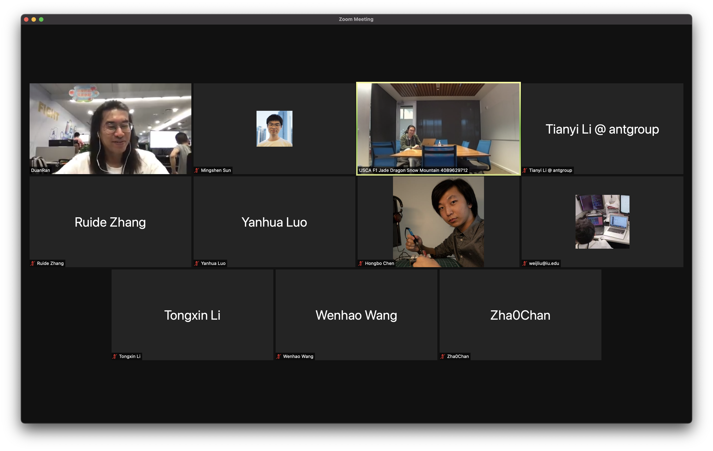

In Aug 26, we gathered on Zoom for the 7th Teaclave meetup. In this meetup,
Mingshen briefly introduce recent updates in Teaclave, and also introduce new
members attending the meetup.

For all Teaclave events, we publish a *Teaclave Community Event Calendar*:
<https://calendar.google.com/calendar/u/0/embed?src=l1q5osem2br8i4bj7dgik5sae4@group.calendar.google.com>.
You can subscribe to see our latest schedule information including the Zoom
link.

Here is the minutes for Teaclave Meetup #7 on Aug 26, 2021.

## Attendees

- Mingshen Sun
- Ran Duan
- Tianyi Li
- Ruide Zhang
- Yanhua Luo
- Hongbo Chen
- Weijie Liu
- Tongxin Li
- Wenhao Wang
- Chan Zhao

## Agenda

- Recent updates in Teaclave - Mingshen Sun
- Free discussion

## Notes

### Recent updates in Teaclave - Mingshen

**Teaclave Faas Platform**

- Add TVM MNIST example (#535)
- Add IDE helper script (#539)
- Release v0.3.0: [https://teaclave.apache.org/download/#teaclave](https://teaclave.apache.org/download/#teaclave)

**Teaclave TrustZone SDK**

- TEE Socket APIs and examples
- Upgrade building docker to Ubuntu 20.04
- Switch to GitHub Actions
- Add -rs to examples and update test scripts (#34)
- Update to OP-TEE 3.14.0 (#35)

**Teaclave SGX SDK**

- Intel SGX SDK 2.14

**Website**

- [blog] [Podling Teaclave Report - August 2021 · Aug 01 2021](https://teaclave.apache.org/blog/2021-08-02-podling-teaclave-report-august-2021/)
- [blog] [使用 Teaclave SGX SDK 开发 SGX 应用 · Aug 24 2021](https://teaclave.apache.org/blog/2021-08-25-developing-sgx-application-with-teaclave-sgx-sdk/)

**External Collaboration**

- Teaclave/Intel: Integrating Graphene as a new Library OS executor
- Teaclave/OP-TEE: Integrating examples in Rust TrustZone SDK in OP-TEE

### Free Discussion

Intro

- New members: Tianyi Li from Ant Group, Wenhao Wang from CAS

About Occlum NGO

- Mingshen: what is Occlum NGO? [https://github.com/occlum/ngo](https://github.com/occlum/ngo)
- Wenhao: related news: [https://juejin.cn/post/6963839027665436709](https://juejin.cn/post/6963839027665436709)
- Ran: will discuss with the Occlum group

## Group Photos

